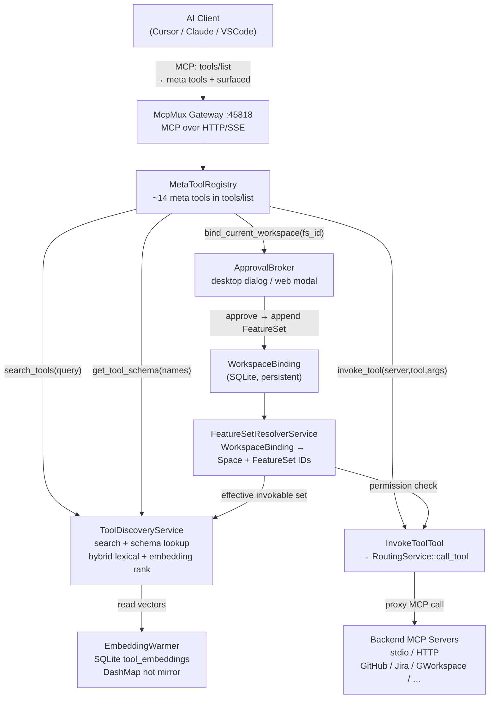

# McpMux Backend Architecture

**Last Updated:** Jun 1, 2026

---

## What McpMux Is

A local MCP gateway (`localhost:45818`) that multiplexes AI clients (Cursor, Claude Desktop, VS Code, Windsurf) over a single endpoint to any number of backend MCP servers. Core product properties:

- **Credentials stay local** — encrypted with AES-256-GCM in SQLite + OS keychain (macOS/Linux) or DPAPI (Windows), never in plain-text JSON.
- **Fixed meta surface** — clients see ~14–15 `mcpmux_*` meta tools at startup, not the full backend catalog. Backend tools are discovered progressively via search and invoked through a single entry point.
- **Workspace-scoped capability** — a `WorkspaceBinding` maps a folder root to a curated `FeatureSet`. An agent in `~/code/my-app` only reaches the tools that binding authorizes.
- **Human-authored consent** — capability bundles (FeatureSets) are written by humans. An agent can bind an existing bundle (with approval) but cannot create one.

## What McpMux Is Not

- Not a hosted proxy — the gateway is loopback-only (`127.0.0.1`). Remote access goes through Cloudflare Tunnel + Access on a dedicated hostname.
- Not an LLM router — it routes MCP protocol calls, not natural language.
- Not a replacement for upstream MCP servers — it proxies calls to them after auth, filtering, and OAuth refresh.
- Not a capability aggregator that dumps every tool definition into client context — the whole design is built around keeping context lean.

---

## End-to-End Capability Flow



**Agent workflow for a new capability:**

```
1. search_tools("jira issue")          → inactive match with bindable_feature_set_id
2. bind_current_workspace(fs_id)       → ApprovalBroker approval (desktop or web)
3. search_tools("jira issue")          → active match with schema hint
4. get_tool_schema(["jira_get_issue"]) → parameter spec
5. invoke_tool("jira", "get_issue", …) → result from backend server
```

After step 2 every future agent session in that workspace root inherits the binding automatically.

---

## Subsystem Map

| Subsystem | Crate | Technical doc |
| --------- | ----- | ------------- |
| **Consent & Binding** — FeatureSet as capability unit, WorkspaceBinding, approval broker | `mcpmux-core`, `mcpmux-gateway` | [`consent-and-binding.md`](./consent-and-binding.md) |
| **Tool Discovery & Search** — search → schema → invoke, hybrid ranking, session cache, diagnostics | `mcpmux-gateway` | [`tool-discovery-and-search.md`](./tool-discovery-and-search.md) |
| **Embedding Cache** — `EmbeddingWarmer`, SQLite persistence, global DashMap mirror | `mcpmux-gateway`, `mcpmux-storage` | [`embedding-cache.md`](./embedding-cache.md) |
| **Services Overview** — Axum request path, per-client auth, routing, FeatureSet filtering, OAuth refresh | `mcpmux-gateway` | `services-overview.md` _(Phase 3)_ |
| **Server Lifecycle & Pool** — connection pool, session readiness, account clones, transports | `mcpmux-gateway`, `mcpmux-mcp` | `server-lifecycle-and-pool.md` _(Phase 3)_ |
| **Security & Credentials** — OAuth 2.1+PKCE, DCR, AES-256-GCM, keychain/DPAPI | `mcpmux-storage`, `mcpmux-gateway` | `security-and-credentials.md` _(Phase 3)_ |
| **Data Model** — entities, repository traits, EventBus | `mcpmux-core` | `data-model.md` _(Phase 3)_ |

---

## Crate Responsibilities

| Crate | Role |
| ----- | ---- |
| `mcpmux-core` | Domain entities (`Space`, `FeatureSet`, `WorkspaceBinding`, `InstalledServer`, `Client`), repository traits, `EventBus`, application services |
| `mcpmux-gateway` | Axum gateway, `MetaToolRegistry`, `ToolDiscoveryService`, `InvokeToolTool`, `FeatureService`, `RoutingService`, OAuth token refresh, session roots |
| `mcpmux-storage` | SQLite persistence, AES-256-GCM field-level encryption, `SqliteEmbeddingRepository`, OS keychain / DPAPI key storage |
| `mcpmux-mcp` | MCP protocol client management via `rmcp` SDK |
| `apps/desktop/src-tauri` | Tauri 2 shell, Tauri commands, system tray, deep-link handler |

Cross-crate communication goes through `EventBus` domain events. Storage is always behind repository traits — no SQLx calls from gateway or app code directly.
