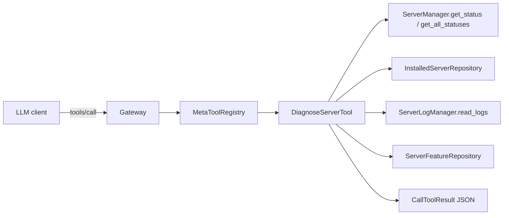

# mcpmux_diagnose_server Meta Tool

| Field | Value |
| --- | --- |
| Status | Done |
| Branch | feat/web-ui |
| Epic | Meta tools / operator diagnostics |
| Estimated effort | ~1 day |

## Overview

Add a single read-only `mcpmux_diagnose_server` meta tool exposed to LLM clients connected through the gateway. One call returns enough context to debug a broken MCP server: runtime connection status, transport config (keys only for secrets), missing required inputs, and a recent log tail.

**What this is:** A combo diagnostic tool for agents and operators debugging server health inside the caller's resolved Space.

**What this is not:** A write tool, a log-clearing tool, or a cross-Space admin API. It does not redact log content beyond what the desktop ServerLogViewer already shows.

## Decisions

| Decision | Choice | Rationale |
| --- | --- | --- |
| Tool shape | Single combo tool `mcpmux_diagnose_server` | One-shot debugging; avoids multi-call orchestration by agents |
| `server_id` arg | Optional | Omitted = return every unhealthy server in the Space; present = diagnose that server regardless of health |
| Payload | Status + config + missing inputs + log tail | Enough to act without opening the desktop UI |
| Default logs | Last 50 entries, all levels | Overridable via `log_limit` / `log_level_filter` / `include_logs` |
| Secret posture | Trust (raw logs) | Matches desktop ServerLogViewer; operator tool, not public API |
| Scope | Caller's resolved Space only | Consistent with every other `mcpmux_*` meta tool |

## Scope

### In

- Extend `MetaToolContext` with `ServerManager` + `ServerLogManager`
- New `diagnose.rs` module with helpers + `DiagnoseServerTool`
- Register tool in `build_default_registry`
- Integration tests in `tests/rust/tests/integration/meta_tools.rs`
- README + guide doc mention

### Out

- Log redaction / sanitisation — deferred; desktop already exposes raw logs
- Rotated log file reads — `read_logs` only reads `current.log` (same as UI)
- Separate status/logs/list-unhealthy tools — combo tool covers all three use cases
- Cross-Space diagnostics — violates existing meta tool Space resolution model
- Suggested next-action hints — not in v1 payload

## Architecture



`MetaToolContext` already has repos for installed servers and features. Phase 1 threads in `ServerManager` and `ServerLogManager` from `GatewayDependencies` / `PoolServices` (both exist; not yet on the context).

### Output shape

```json
{
  "space_id": "...",
  "servers": [
    {
      "server_id": "github",
      "display_name": "GitHub",
      "health": "error",
      "runtime": {
        "status": "error",
        "flow_id": 42,
        "has_connected_before": true,
        "message": "Connection refused"
      },
      "config": {
        "transport_type": "stdio",
        "command": "npx",
        "args": ["-y", "@modelcontextprotocol/server-github"],
        "env_keys": ["GITHUB_TOKEN"],
        "input_keys": ["github_token"]
      },
      "missing_required_inputs": ["github_token"],
      "logs": {
        "count": 12,
        "level_filter": null,
        "entries": [
          { "ts": "...", "lvl": "error", "src": "stderr", "msg": "...", "meta": {} }
        ]
      },
      "tool_count": 0
    }
  ],
  "total_unhealthy": 1
}
```

`health` values: `healthy` | `error` | `auth_required` | `needs_setup` | `disconnected`

### Input schema

| Arg | Type | Default | Notes |
| --- | --- | --- | --- |
| `server_id` | string | — | Optional. When omitted, only unhealthy servers are returned |
| `include_logs` | boolean | `true` | Set `false` to omit the `logs` block |
| `log_limit` | integer | `50` | Max 500 |
| `log_level_filter` | enum | — | `trace` / `debug` / `info` / `warn` / `error` |

## Files to create

| Path | Purpose |
| --- | --- |
| [`crates/mcpmux-gateway/src/services/meta_tools/diagnose.rs`](../crates/mcpmux-gateway/src/services/meta_tools/diagnose.rs) | `DiagnoseServerTool` + helpers |

## Files to modify

| Path | Change |
| --- | --- |
| [`crates/mcpmux-gateway/src/services/meta_tools/registry.rs`](../crates/mcpmux-gateway/src/services/meta_tools/registry.rs) | Add `server_manager` + `log_manager` to `MetaToolContext` |
| [`crates/mcpmux-gateway/src/services/meta_tools/mod.rs`](../crates/mcpmux-gateway/src/services/meta_tools/mod.rs) | `pub mod diagnose`; extend `build_default_registry`; register tool |
| [`crates/mcpmux-gateway/src/server/service_container.rs`](../crates/mcpmux-gateway/src/server/service_container.rs) | Pass `ServerManager` + `ServerLogManager` into registry factory |
| [`tests/rust/tests/integration/meta_tools.rs`](../tests/rust/tests/integration/meta_tools.rs) | Integration tests for diagnose tool |
| [`README.md`](../README.md) | Add tool to meta-tools list |
| [`docs/guide/servers.mdx`](../guide/servers.mdx) | One-line reference if meta tools are enumerated there |

## Phasing

### Phase 1 — Thread dependencies into MetaToolContext

~30 min

- Add `pub server_manager: Arc<ServerManager>` and `pub log_manager: Arc<ServerLogManager>` to `MetaToolContext`
- Extend `build_default_registry` signature in `mod.rs`
- Wire call site in `service_container.rs::ServiceContainer::initialize`
- `cargo check -p mcpmux-gateway`

**Outcome:** Workspace compiles. No new tool advertised yet. DI surface is ready.

### Phase 2 — Diagnostic helpers

~1 hr

Port logic from [`apps/desktop/src/features/dashboard/dashboard.helpers.ts`](../../apps/desktop/src/features/dashboard/dashboard.helpers.ts):

- `parse_missing_required_inputs(installed)` — `cached_definition` + `input_values`
- `classify_health(status, has_missing_inputs)` — maps to health bucket
- `build_config_view(installed)` — transport type, command, args, env/input keys (no secret values)

Add `#[cfg(test)]` unit tests for missing-input and health-classification edges.

**Outcome:** Helpers compile and unit tests pass in isolation.

### Phase 3 — DiagnoseServerTool implementation

~2 hr

- Implement `MetaTool` in `diagnose.rs` (read-only, no approval broker)
- `call()` flow:
  1. Resolve caller Space via `caller_space_id`
  2. Load installed servers + runtime statuses
  3. Filter by `server_id` or unhealthy-only
  4. Build per-server payload (runtime, config, missing inputs, logs, tool_count)
  5. Return JSON via `text_result`
- Register in `build_default_registry` alongside other reads

**Outcome:** `mcpmux_diagnose_server` appears in `tools/list`. No-arg call returns unhealthy servers with last 50 log lines. Explicit `server_id` returns that server even when healthy.

### Phase 4 — Tests + doc surface

~1 hr

Integration tests in `meta_tools.rs`:

- Tool registered in `tools/list`
- No-arg call returns only unhealthy servers
- Explicit `server_id` returns target server regardless of health
- `include_logs: false` omits logs block
- Missing required input surfaced in `missing_required_inputs`

Update README and guide doc.

**Outcome:** `pnpm test:rust:int` green. Tool documented in README + guide.

### Phase 5 — Validation + doc reconciliation

~30 min

- `pnpm validate`
- `pnpm test:rust`
- Update this doc: status → Done, mark phases complete, add "What was built" section with any deviations

**Outcome:** All CI gates green. This planning doc reflects as-built state.

## Key files referenced

| Path | Notes |
| --- | --- |
| [`crates/mcpmux-gateway/src/services/meta_tools/tools.rs`](../crates/mcpmux-gateway/src/services/meta_tools/tools.rs) | Canonical `MetaTool` impl pattern |
| [`crates/mcpmux-gateway/src/services/meta_tools/registry.rs`](../crates/mcpmux-gateway/src/services/meta_tools/registry.rs) | `MetaToolContext` to extend |
| [`crates/mcpmux-gateway/src/pool/server_manager.rs`](../crates/mcpmux-gateway/src/pool/server_manager.rs) | `get_all_statuses` shape |
| [`crates/mcpmux-core/src/service/server_log_manager.rs`](../crates/mcpmux-core/src/service/server_log_manager.rs) | `read_logs` signature |
| [`apps/desktop/src/features/dashboard/dashboard.helpers.ts`](../../apps/desktop/src/features/dashboard/dashboard.helpers.ts) | JS source for health + missing-input logic |
| [`crates/mcpmux-gateway/src/admin/live_runtime.rs`](../crates/mcpmux-gateway/src/admin/live_runtime.rs) | `ConnectionStatus` → UI string mapping reference |
| [`tests/rust/tests/integration/meta_tools.rs`](../tests/rust/tests/integration/meta_tools.rs) | Existing integration test scaffolding |

## Related documentation

- [`AGENTS.md`](../../AGENTS.md) — meta tools overview, build commands
- [`docs/guide/feature-sets.mdx`](../guide/feature-sets.mdx) — FeatureSet + meta tool context
- [`docs/guide/servers.mdx`](../guide/servers.mdx) — server lifecycle + health UI

## Progress log

| Date | Phase | Notes |
| --- | --- | --- |
| 2026-05-27 | Planning | Decisions locked via dig-and-ask; doc created |
| 2026-05-27 | Phase 1 | `MetaToolContext` extended with `server_manager` + `log_manager`; wired in `service_container.rs` |
| 2026-05-27 | Phase 2 | Diagnostic helpers + unit tests in `diagnose.rs` |
| 2026-05-27 | Phase 3 | `DiagnoseServerTool` registered in `build_default_registry` |
| 2026-05-27 | Phase 4 | Integration tests in `meta_tools.rs`; README + `docs/guide/servers.mdx` updated |
| 2026-05-27 | Phase 5 | `pnpm validate` + `pnpm test:rust` green; ServersPage ESLint fix; doc reconciled |

## What was built

Read-only `mcpmux_diagnose_server` meta tool in [`crates/mcpmux-gateway/src/services/meta_tools/diagnose.rs`](../crates/mcpmux-gateway/src/services/meta_tools/diagnose.rs). One call returns per-server runtime status, redacted transport config (command/args/env/input/header keys only — no secret values), missing required inputs, optional log tail, and `tool_count`. No-arg calls filter to unhealthy servers only; explicit `server_id` returns that server regardless of health.

**Commits (feat/web-ui):** `c301b32` Phase 1 → `011f679` Phase 2 → `31bb3d3` Phase 3 → `4c09e62` Phase 4 → Phase 5 chore commit.

**Deviations from plan:**

| Area | Planned | As-built |
| --- | --- | --- |
| `ConfigView` | `transport_type`, `command`, `args`, `env_keys`, `input_keys` | Also includes `url` and `header_keys` for HTTP transports |
| Guide doc | One-line in meta-tools enumeration | Added to [`docs/guide/servers.mdx`](../guide/servers.mdx) clone-lineage paragraph instead (meta tools not enumerated there) |
| Tests | `meta_tools.rs` only | Also asserts registration in `meta_gateway_invoke.rs` |
| Phase 5 scope | Validation + doc only | Unblocked `pnpm validate` by fixing [`ServersPage.tsx`](../../apps/desktop/src/features/servers/ServersPage.tsx): replaced direct `@tauri-apps/plugin-dialog` import with `pickPath` from `@/lib/backend/shell` (user-approved) |

**Validation:** `pnpm validate` exit 0; `pnpm test:rust` — 739 passed, 1 skipped.
