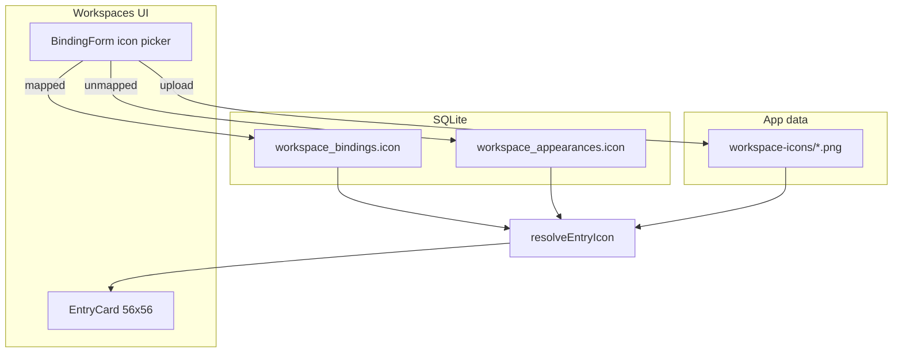

# Workspace Binding Icons

**Last Updated:** May 25, 2026
**Status:** Complete — Phases 1–4 shipped
**Branch:** `dev`
**Base branch:** `main`
**Depends on:** Workspace bindings + label field (migration 016, shipped)
**Unblocks:** Visual scanning of the Workspaces page — distinguish projects at a glance without reading paths

---

## Problem

Every workspace card on the Workspaces page rendered the same Lucide `FolderOpen` glyph inside a tone-colored 56×56 box. Bindings already support a friendly `label`, but there was no way to set a visual identity — emoji or custom image — for a folder.

Users wanted to:

- Pick an emoji (freeform, not limited to a preset grid).
- Upload a custom image (logo, screenshot, brand mark).
- Set icons on **unmapped live** folders before a binding exists, so cards are identifiable while routing is still being configured.

---

## Decisions

| # | Decision | Choice | Rationale |
| - | -------- | ------ | --------- |
| 1 | Card scope | **All workspace cards** — unmapped live, mapped live, mapped offline | User explicitly wants icons on every card, not just saved bindings. |
| 2 | Unmapped storage | New `workspace_appearances` table keyed by normalized `workspace_root` | Unmapped entries have no binding row; appearance must persist independently until a binding is created. |
| 3 | Bound storage | Nullable `icon` column on `workspace_bindings` (migration 020) | Keeps icon co-located with other binding metadata; matches Space / FeatureSet `icon` field pattern. |
| 4 | Icon value shape | **Single optional string** — emoji text OR `https://` URL OR `local:workspace-icons/...` ref | Same convention as Space (`emoji or URL`) and `ServerIcon`; one field, one renderer. |
| 5 | Image storage | Copy uploaded file into `<app_data>/workspace-icons/`; store `local:` ref in SQLite | Avoids bloating SQLite with base64; files survive app restarts; aligns with existing app data dir usage in `lib.rs`. |
| 6 | Emoji UX | **Freeform text input** (Feature Set panel pattern) | User rejected preset grid; allows any emoji or short glyph. |
| 7 | Fallback | Keep current **`FolderOpen` Lucide icon** inside tone-colored box | User wants status tones (amber/emerald/neutral) preserved; only replace glyph when icon is set. |
| 8 | Display precedence | `binding.icon` → `appearance.icon` → `FolderOpen` | Binding is authoritative once it exists; appearance covers the unmapped gap. |
| 9 | Bind migration | On binding create from unmapped root: copy appearance icon onto binding if binding icon empty; delete appearance row | Prevents duplicate storage and keeps one resolver path for mapped entries. |

---

## The Model



**Icon string encoding:**

| Shape | Meaning | Render |
| ----- | ------- | ------ |
| `https://...` | Remote URL | `` via extended `ServerIcon` |
| `local:workspace-icons/{uuid}.png` | File under app data | `convertFileSrc(absolutePath)` after Tauri resolve |
| anything else | Emoji / short text | Text span (existing emoji path in `ServerIcon`) |

**Upload pipeline:**

1. Frontend opens `@tauri-apps/plugin-dialog` with image filters.
2. Rust copies source into `{data_dir}/workspace-icons/{uuid}.png` (resize to max 256px; normalize to PNG using existing `image` crate dep).
3. Returns `local:workspace-icons/{uuid}.png`.
4. On icon clear/replace, delete orphaned file if no row references it.

Frontend `resolveEntryIcon(entry, appearanceByRoot)` mirrors backend precedence:

```text
entry.binding?.icon ?? appearanceByRoot.get(normalize(entry.root)) ?? null → FolderOpen
```

---

## Scope

**In (shipped):**

- Migration 020 — `workspace_bindings.icon` + `workspace_appearances` table
- Domain entity, repository trait, SQLite repo, Tauri commands, TS API
- Icon picker in binding side panel: freeform emoji, upload, clear, live preview
- `EntryCard` + detail panel header render resolved icon
- Load appearances on page mount; refresh on binding/appearance change events
- Extended `ServerIcon` for `local:` refs

**Out:**

- Space / Feature Set image upload — separate surfaces; can reuse extended icon renderer later
- Auto-detect emoji from folder name or path
- Changing tone-colored box styling when a custom icon is set
- Meta-tool / gateway surfacing of workspace icons
- E2E test additions — deferred unless explicitly requested
- Paste-from-clipboard image input — upload via file picker only in v1

---

## File Inventory

### Phase 1 — Storage and domain (✅)

- `crates/mcpmux-storage/src/migrations/020_workspace_icons.sql` — `ALTER TABLE workspace_bindings ADD COLUMN icon TEXT`; `CREATE TABLE workspace_appearances (workspace_root TEXT PRIMARY KEY, icon TEXT NOT NULL, updated_at TEXT NOT NULL)`.
- [`crates/mcpmux-storage/src/database.rs`](../../crates/mcpmux-storage/src/database.rs) — register migration 020.
- [`crates/mcpmux-core/src/domain/workspace_binding.rs`](../../crates/mcpmux-core/src/domain/workspace_binding.rs) — add `icon: Option<String>`.
- `crates/mcpmux-core/src/domain/workspace_appearance.rs` — new entity (`workspace_root`, `icon`, `updated_at`).
- [`crates/mcpmux-core/src/repository/mod.rs`](../../crates/mcpmux-core/src/repository/mod.rs) — `WorkspaceAppearanceRepository` trait (`list`, `get`, `upsert`, `delete`).
- `crates/mcpmux-storage/src/repositories/workspace_appearance_repository.rs` — SQLite impl.
- [`crates/mcpmux-storage/src/repositories/workspace_binding_repository.rs`](../../crates/mcpmux-storage/src/repositories/workspace_binding_repository.rs) — read/write `icon` column on INSERT/UPDATE/SELECT.
- `tests/rust/src/mocks.rs` — mock repo impl for appearance trait.

### Phase 2 — Upload service and Tauri commands (✅)

- `apps/desktop/src-tauri/src/commands/workspace_appearance.rs` — `list_workspace_appearances`, `upsert_workspace_appearance`, `delete_workspace_appearance`, `upload_workspace_icon`, `resolve_workspace_icon_path`.
- [`apps/desktop/src-tauri/src/commands/workspace_binding.rs`](../../apps/desktop/src-tauri/src/commands/workspace_binding.rs) — pass `icon` through create/update DTOs; migrate appearance → binding on create.
- [`apps/desktop/src-tauri/src/lib.rs`](../../apps/desktop/src-tauri/src/lib.rs) — register new commands.
- Domain event emission on appearance change (`WorkspaceAppearanceChanged`; reuses `workspace-binding-changed` UI channel).

### Phase 3 — Frontend (✅)

- [`apps/desktop/src/lib/api/workspaceBindings.ts`](../../apps/desktop/src/lib/api/workspaceBindings.ts) — extend `WorkspaceBinding`, `WorkspaceBindingInput` with `icon`.
- `apps/desktop/src/lib/api/workspaceAppearances.ts` — new API module.
- [`apps/desktop/src/components/ServerIcon.tsx`](../../apps/desktop/src/components/ServerIcon.tsx) — handle `local:` prefix via async resolve + `convertFileSrc`.
- [`apps/desktop/src/features/workspaces/WorkspacesPage.tsx`](../../apps/desktop/src/features/workspaces/WorkspacesPage.tsx) — load appearances; `resolveEntryIcon` helper; icon picker in `BindingFormContent`; update `EntryCard` and detail panel header.

### Phase 4 — Reconcile planning doc (✅)

- [`docs/planning/workspace-binding-icons.md`](./workspace-binding-icons.md) — status, inventory checkmarks, shipped phase outcomes, autonomous decisions.

---

## Phasing

### Phase 1 — Storage and domain (✅ shipped `acd48c0`)

- Wrote and registered migration 020.
- Added `icon` to `WorkspaceBinding`; created `WorkspaceAppearance` entity and repository.
- Wired repos into application services / `AppState`.
- Rust unit tests: binding icon round-trip; appearance upsert/get/delete by normalized root.

**Outcome:** `cargo nextest run -p mcpmux-core -p mcpmux-storage` passes with icon/appearance coverage; bindings and appearances persist `icon` via repo methods.

### Phase 2 — Upload service and Tauri commands (✅ shipped `6c94d1c`)

- Implemented `upload_workspace_icon` — copy, resize, return `local:` ref; reject oversize inputs (>2MB).
- Implemented `resolve_workspace_icon_path` for webview rendering.
- Extended binding create/update commands with `icon`; on create, migrate appearance icon if binding icon empty and delete appearance row.
- Orphan file cleanup when icon cleared or replaced (repository-wide ref check before delete).
- Emitted `WorkspaceAppearanceChanged` on the existing `workspace-binding-changed` channel so the Workspaces page reloads without navigation.

**Outcome:** Tauri invoke round-trip works — upload image, upsert appearance for unmapped root, create binding with icon — all persist correctly; orphaned PNG removed on replace.

### Phase 3 — Frontend picker and rendering (✅ shipped `37dcc50`)

- Added appearances API; extended bindings API types.
- Icon section in binding form: freeform emoji input, Upload button (Tauri dialog), Clear, 56×56 preview.
- Autosave: include `icon` in binding payload when mapped; call appearance upsert when unmapped.
- Updated `EntryCard` and detail panel header to render resolved icon; fallback remains `FolderOpen` inside tone box.

**Outcome:** User sets emoji or uploads image on any workspace card from the side panel; cards and panel header reflect the choice immediately; unmapped folders retain icon before binding; creating a binding preserves the icon.

### Phase 4 — Reconcile planning doc (✅)

- Updated this file's status, file inventory checkmarks, phase outcomes, and autonomous decisions to match shipped implementation on `dev`.

**Outcome:** This doc matches shipped implementation; no stale "Planned" status.

---

## Autonomous decisions

| Phase | Decision | Rationale |
| ----- | -------- | --------- |
| 1 | Dedicated SQLite repository file + nested module wiring for appearances | Enabled Phase 1 tests without expanding surface area beyond inventory |
| 1 | Optional `icon` on bindings only; label and feature-set semantics unchanged | Minimized behavior risk for existing routing logic |
| 2 | Reused `workspace-binding-changed` UI channel for `WorkspaceAppearanceChanged` | Keeps frontend listener compatibility without Phase 3 listener edits |
| 2 | Repository-wide orphan cleanup before deleting local icon files | Prevents accidental removal when refs are shared across binding/appearance rows |
| 2 | Normalize all uploads to PNG, max 256px | Deterministic render payload and upload-size constraints |
| 3 | Single `ServerIcon` local-ref resolver path | Consistent emoji/URL/local rendering across cards, panel headers, and previews |
| 3 | Autosave unmapped icons to `workspace_appearances` in-panel | Preserves icon identity before binding creation without manual save friction |

---

## Out of scope

- Space / Feature Set image upload — same renderer can be reused later; not part of this ticket.
- Meta-tool listing of workspace icons — no agent-facing requirement identified.
- SVG as stored format — rasterize to PNG on upload or reject SVG in v1 to avoid webview XSS surface.
- Changing card tone colors when a custom icon is present — status semantics stay on the box, not the glyph.

---

## Risks and mitigations

| Risk | Mitigation |
| ---- | ---------- |
| Webview cannot load arbitrary file paths | Always render local icons through `convertFileSrc` after Rust resolves absolute path under app data |
| Orphaned PNGs accumulate | Delete old file on icon replace/clear; optional startup sweep deferred |
| Duplicate icon storage (appearance + binding) | Migrate appearance → binding on create; display prefers binding |
| Large uploads | Resize to 256px max on ingest; reject files over 2MB |
| Icon set on unmapped root, then binding created elsewhere | Key appearances by normalized root; migration copies on bind for matching root |

---

## Validation

- `cargo nextest run -p mcpmux-core -p mcpmux-storage` — icon/appearance repo tests pass.
- `pnpm typecheck` — TS API and Workspaces page compile.
- Manual: set emoji on unmapped card → persists across refresh → create binding → icon survives on mapped card.
- Manual: upload PNG → renders in card → replace with emoji → old PNG deleted from app data.
- `pnpm validate` before merge.

---

## Key files referenced

| File | Note |
| ---- | ---- |
| [`WorkspacesPage.tsx`](../../apps/desktop/src/features/workspaces/WorkspacesPage.tsx) | Entry union, `EntryCard`, binding form autosave, `resolveEntryIcon` |
| [`workspace_binding.rs`](../../crates/mcpmux-core/src/domain/workspace_binding.rs) | Binding entity — `icon` field |
| [`ServerIcon.tsx`](../../apps/desktop/src/components/ServerIcon.tsx) | Emoji/URL/`local:` renderer |
| [`FeatureSetPanel.tsx`](../../apps/desktop/src/features/featuresets/FeatureSetPanel.tsx) | Freeform emoji input pattern |
| [`lib.rs`](../../apps/desktop/src-tauri/src/lib.rs) | `get_app_data_dir()` for icon file storage |
| [`server-display-rename.md`](./server-display-rename.md) | Planning doc format reference |

---

## Related documentation

- [Server Display Rename](server-display-rename.md) — recent binding/label UX work on adjacent surfaces
- [Agent MCP Session Readiness](agent-mcp-session-readiness.md) — workspace roots and binding timing context
